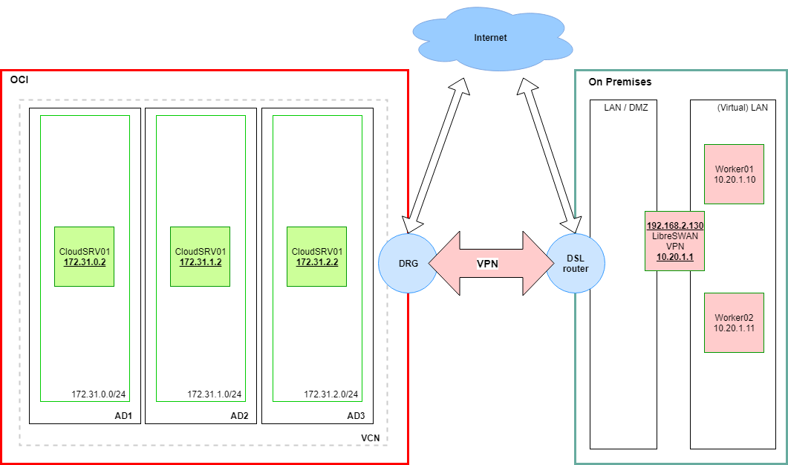

# vpn_sandbox
This is an example of a VPN setup between Oracle Cloud Infrastructure and an open source LibreSWAN solution.
The setup is based on a [blog article](https://blogs.oracle.com/cloud-infrastructure/creating-a-secure-connection-between-oracle-cloud-infrastructure-and-other-cloud-providers).

# Purpose: 
It is for training purposes only! I have created this example to play with some of [OCI](https://cloud.oracle.com) services and be able to create an HoL faster.
It is --> ***definitely*** <-- not for production purposes - it tests only some basic functionality of [Oracle Cloud Infrastructure IPSEC VPNs](https://docs.cloud.oracle.com/iaas/Content/Network/Tasks/managingIPsec.htm#Example)
#### During deployment, You will create some resources that could cost you $$$

# Architecture
The solution components.

* 1 Virtual Cloud Network (**VCN**)
* 3 Subnets (1x AD)
* 3 VM Hosts (1 per AD)
* Route Table
* Security List
* **DRG** Distributed Routing Gateway
* output generates your (dynamic) files configuration on LibreSWAN




### Configuration files

#### `configuration.tf`
Is used to set your local environment (on Premises) variables as well as basic image used in the configuration. 

#### `env-vars.tf`
Defines the provider and your basic authentication configuration.


### Tips
* If you want to destroy a specific resource, you can run the `terraform` command
with `target` parameter as in the following example:

```
terraform destroy -target oci_core_instance.server_name_01 -target oci_core_instance.server_name_02
```
